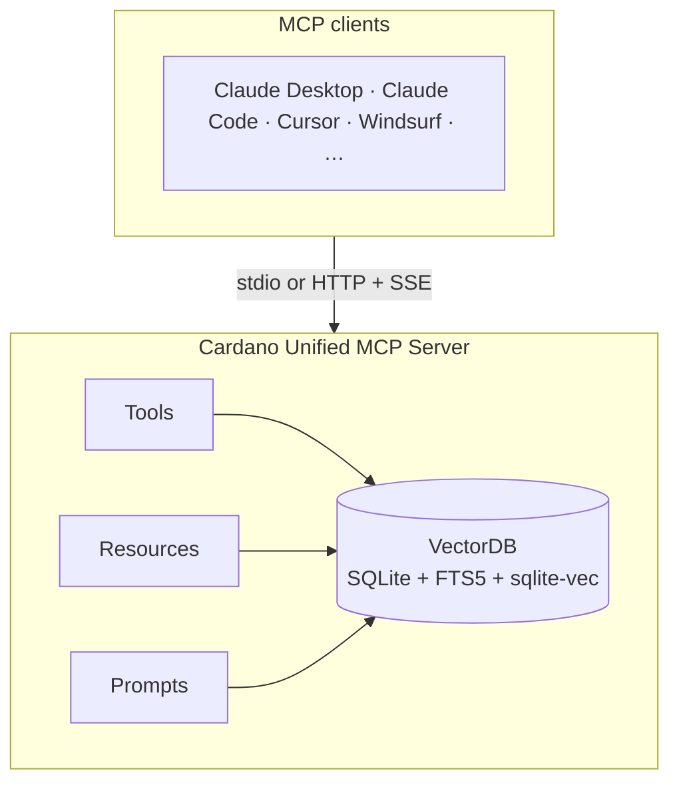

# Cardano Unified MCP Server

[](https://github.com/easy1staking-com/cardano-unified-mcp-server/actions/workflows/validate-sources.yml)

An independent, community-maintained [Model Context Protocol](https://modelcontextprotocol.io/) (MCP) server that gives AI assistants deep knowledge of the Cardano ecosystem — documentation, SDKs, smart contract languages, governance, scaling, and developer standards, all searchable from a single endpoint.

Run by [Easy1Staking](https://easy1staking.com). **Hosted instance:** `mcp.easy1staking.com`

> **New here?** MCP is an open standard that lets an AI assistant plug into external knowledge servers. Connect this one and your assistant can answer Cardano development questions with citations to real upstream docs instead of making things up.
>
> Read [ABOUT.md](ABOUT.md) for the full story — what this project is, where the knowledge comes from, how it is vetted, and who maintains it. Read [docs/architecture.md](docs/architecture.md) for the component, query, and ingestion diagrams.

## What's Inside

40+ documentation sources across 7 categories, continuously ingested from GitHub:

- **Infrastructure** — Ogmios, Kupo, Blockfrost, Mithril, Oura, Pallas, Dolos, Yaci Store, Koios, Cardano GraphQL, Cardano Wallet, Cardano Node Wiki, DB-Sync
- **Smart Contracts** — Aiken (lang + stdlib + examples + design patterns), Plutus, OpShin, Plutarch, Plu-ts, Scalus, Pebble, CIP-113 Programmable Tokens, Smart Contract Vulnerabilities (26 patterns)
- **SDKs** — Mesh SDK, Evolution SDK, cardano-js-sdk, PyCardano, cardano-client-lib, Cardano Serialization Lib, Buildooor
- **Governance** — GovTool, SanchoNet
- **Scaling** — Hydra, Ouroboros Leios
- **Testing** — Yaci DevKit
- **Standards** — CIPs (170+), Developer Portal, Cardano Docs

See [ECOSYSTEM.md](ECOSYSTEM.md) for the full Cardano developer tooling landscape.

## Features

### MCP Tools
- **`search_docs`** — Hybrid semantic + keyword search across all indexed documentation
- **`get_doc`** — Retrieve full content of a specific document
- **`list_topics`** — Browse available sources and their topics

### MCP Resources
- `cardano://sources` — Overview of all indexed sources
- `cardano://source/{name}` — Topic listing for a specific source
- `cardano://doc/{source}/{path}` — Full document content

### MCP Prompts
- **`review-contract`** — Security review for Aiken/Plutus/OpShin contracts
- **`explain-cip`** — Developer-focused CIP explanations
- **`suggest-tooling`** — Recommend the right tools for your project
- **`build-transaction`** — Step-by-step transaction building guide
- **`governance-guide`** — CIP-1694 governance participation guide

## Quick Start

### Use the hosted instance

Add to your MCP client configuration (Claude Desktop, Claude Code, Cursor, etc.):

```json
{
  "mcpServers": {
    "cardano": {
      "url": "https://mcp.easy1staking.com/mcp"
    }
  }
}
```

### Run locally (stdio)

```bash
git clone https://github.com/easy1staking-com/cardano-unified-mcp-server.git
cd cardano-unified-mcp-server
npm install
npm run build

# Ingest documentation (requires EMBEDDINGS_API_KEY for semantic search)
cp .env.example .env
# Edit .env with your OpenAI API key
npm run ingest

# Run in stdio mode
node dist/index.js --stdio
```

Add to your MCP client:

```json
{
  "mcpServers": {
    "cardano": {
      "command": "node",
      "args": ["/path/to/cardano-unified-mcp-server/dist/index.js", "--stdio"]
    }
  }
}
```

### Run as HTTP server

```bash
# Start the server (default port 3000)
npm start

# Or with API key protection
MCP_API_KEY=your-secret npm start
```

## Configuration

| Variable | Default | Description |
|----------|---------|-------------|
| `PORT` | `3000` | HTTP server port |
| `HOST` | `0.0.0.0` | Bind address |
| `EMBEDDINGS_API_KEY` | — | OpenAI API key for semantic search |
| `EMBEDDINGS_API_BASE` | `https://api.openai.com/v1` | OpenAI-compatible endpoint |
| `EMBEDDINGS_MODEL` | `text-embedding-3-large` | Embedding model |
| `MCP_API_KEY` | — | Optional Bearer token for HTTP mode |
| `DB_PATH` | `./data/docs.db` | SQLite database path |
| `REPOS_DIR` | `./repos` | Cloned repositories directory |

## Architecture



Full component, query, and ingestion diagrams in [docs/architecture.md](docs/architecture.md).

### Search modes

- **Hybrid** (default) — BM25 full-text (40%) + vector similarity (60%)
- **Semantic** — Embedding cosine similarity only
- **Keyword** — Full-text search with Porter stemming (no API key needed)

## Kubernetes Deployment

The server is designed for stateless horizontal scaling on Kubernetes:

```bash
# Apply manifests
kubectl apply -f k8s/deployment.yaml
kubectl apply -f k8s/cronjob-ingest.yaml

# Create secrets
kubectl create secret generic cardano-mcp-secrets \
  --from-literal=EMBEDDINGS_API_KEY=sk-... \
  --from-literal=MCP_API_KEY=your-secret
```

- 2 replicas with health checks
- Persistent volume for the SQLite database
- Weekly CronJob for documentation re-ingestion

## Ingestion

The full list of indexed sources lives in [`config/sources.yaml`](config/sources.yaml). See [`docs/sources-schema.md`](docs/sources-schema.md) for the schema reference and [`ABOUT.md`](ABOUT.md#acceptance-criteria-for-a-documentation-source) for the acceptance criteria a new source must meet.

```bash
# Ingest all sources
npm run ingest

# Ingest a specific source (name substring match)
npm run ingest -- Aiken

# Dry-run: fetch and validate, but skip chunking and embeddings
npm run ingest -- --validate-only

# Skip embeddings (keyword-only mode, no API key needed)
npm run ingest -- --skip-embeddings

# Just check that config/sources.yaml loads and validates
npm run validate:sources
```

Pull requests that touch `config/sources.yaml` are gated by the [Validate Sources](.github/workflows/validate-sources.yml) GitHub Action — a malformed entry blocks merge with the exact Zod error in the job log.

## Development

```bash
npm run dev          # Watch mode with hot reload
npm run typecheck    # Type checking only
npm run build        # Compile TypeScript
```

## License

[Apache-2.0](LICENSE)

## Contributing

See [CONTRIBUTING.md](CONTRIBUTING.md) for guidelines and [CODE_OF_CONDUCT.md](CODE_OF_CONDUCT.md) for community standards.
