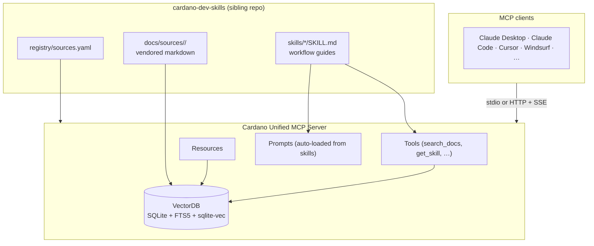

# Cardano Unified MCP Server

[](https://github.com/easy1staking-com/cardano-unified-mcp-server/actions/workflows/skills-drift.yml)

An independent, community-maintained [Model Context Protocol](https://modelcontextprotocol.io/) (MCP) server that gives AI assistants deep knowledge of the Cardano ecosystem — documentation, SDKs, smart contract languages, governance, scaling, and developer standards, all searchable from a single endpoint.

Run by [Easy1Staking](https://easy1staking.com). **Hosted instance:** `mcp.easy1staking.com`

> **New here?** MCP is an open standard that lets an AI assistant plug into external knowledge servers. Connect this one and your assistant can answer Cardano development questions with citations to real upstream docs instead of making things up.
>
> Read [ABOUT.md](ABOUT.md) for the full story — what this project is, where the knowledge comes from, how it is vetted, and who maintains it. Read [docs/architecture.md](docs/architecture.md) for the component, query, and ingestion diagrams.

## What's Inside

50+ documentation sources across 8 categories, sourced from the [cardano-dev-skills](https://github.com/easy1staking-com/cardano-dev-skills) curated registry:

- **Infrastructure** — Ogmios, Kupo, Blockfrost, Mithril, Oura, Pallas, Dolos, Yaci Store, Koios, Cardano GraphQL, Cardano Wallet, Cardano Node Wiki, DB-Sync, Cardano CLI, Amaru
- **Smart Contracts** — Aiken (lang + stdlib + examples + design patterns), Plutus, OpShin, Plutarch, Plu-ts, Scalus, Pebble, Helios, CIP-113 Programmable Tokens (core + platform), Smart Contract Vulnerabilities, Cardano Use Case Templates
- **SDKs** — Mesh SDK, Evolution SDK, cardano-js-sdk, PyCardano, cardano-client-lib, Cardano Serialization Lib, Buildooor, Cardano Connect with Wallet, Cardano Addresses, CIP-113 SDK
- **Standards** — CIPs (170+), Developer Portal, Cardano Docs, Cardano Ledger
- **Governance** — GovTool, SanchoNet
- **Scaling** — Hydra, Ouroboros Leios
- **Oracles** — Charli3 (Pull Oracle Contracts/Client/SDK)
- **Testing** — Yaci DevKit, Cardano Node Antithesis

The authoritative source list lives in [`cardano-dev-skills/registry/sources.yaml`](https://github.com/easy1staking-com/cardano-dev-skills/blob/main/registry/sources.yaml). To add or remove a source, open a PR there.

## Features

### MCP Tools
- **`search_docs`** — Hybrid semantic + keyword search across all indexed documentation
- **`get_doc`** — Retrieve full content of a specific document
- **`list_topics`** — Browse available sources and their topics
- **`list_skills`** — List the workflow skills exposed by this server
- **`get_skill`** — Retrieve the full SKILL.md for a named workflow

### MCP Resources
- `cardano://sources` — Overview of all indexed sources
- `cardano://source/{name}` — Topic listing for a specific source
- `cardano://doc/{source}/{path}` — Full document content

### MCP Prompts

All 15 [cardano-dev-skills](https://github.com/easy1staking-com/cardano-dev-skills) workflows are exposed as MCP prompts. Each takes an optional `request` argument with the user's specific context, then dispatches the skill's workflow (which uses `search_docs` for citations).

`build-transaction` · `cardano-context` · `connect-wallet` · `debug-transaction` · `design-token` · `explain-cip` · `explain-eutxo` · `governance-guide` · `optimize-validator` · `query-chain` · `review-contract` · `scaffold-project` · `setup-devnet` · `suggest-tooling` · `write-validator`

## Quick Start

### Use the hosted instance

Add to your MCP client configuration (Claude Desktop, Claude Code, Cursor, etc.):

```json
{
  "mcpServers": {
    "cardano": {
      "url": "https://mcp.easy1staking.com/mcp"
    }
  }
}
```

### Run locally (stdio)

```bash
# Clone both repos as siblings — this server depends on cardano-dev-skills.
git clone https://github.com/easy1staking-com/cardano-dev-skills.git
git clone https://github.com/easy1staking-com/cardano-unified-mcp-server.git
cd cardano-unified-mcp-server

npm install
npm run build

# Ingest documentation (requires EMBEDDINGS_API_KEY for semantic search)
cp .env.example .env
# Edit .env with your OpenAI API key
npm run ingest

# Run in stdio mode
node dist/index.js --stdio
```

Add to your MCP client:

```json
{
  "mcpServers": {
    "cardano": {
      "command": "node",
      "args": ["/path/to/cardano-unified-mcp-server/dist/index.js", "--stdio"]
    }
  }
}
```

### Run as HTTP server

```bash
# Start the server (default port 3000)
npm start

# Or with API key protection
MCP_API_KEY=your-secret npm start
```

## Configuration

| Variable | Default | Description |
|----------|---------|-------------|
| `PORT` | `3000` | HTTP server port |
| `HOST` | `0.0.0.0` | Bind address |
| `SKILLS_PATH` | `../cardano-dev-skills` | Path to the cardano-dev-skills checkout (registry + vendored docs + skill workflows) |
| `EMBEDDINGS_API_KEY` | — | OpenAI API key for semantic search |
| `EMBEDDINGS_API_BASE` | `https://api.openai.com/v1` | OpenAI-compatible endpoint |
| `EMBEDDINGS_MODEL` | `text-embedding-3-large` | Embedding model |
| `MCP_API_KEY` | — | Optional Bearer token for HTTP mode |
| `DB_PATH` | `./data/docs.db` | SQLite database path |

## Architecture



Full component, query, and ingestion diagrams in [docs/architecture.md](docs/architecture.md).

### Search modes

- **Hybrid** (default) — BM25 full-text (40%) + vector similarity (60%)
- **Semantic** — Embedding cosine similarity only
- **Keyword** — Full-text search with Porter stemming (no API key needed)

## Kubernetes Deployment

The server is designed for stateless horizontal scaling on Kubernetes:

```bash
# Apply manifests
kubectl apply -f k8s/deployment.yaml
kubectl apply -f k8s/cronjob-ingest.yaml

# Create secrets
kubectl create secret generic cardano-mcp-secrets \
  --from-literal=EMBEDDINGS_API_KEY=sk-... \
  --from-literal=MCP_API_KEY=your-secret
```

- 2 replicas with health checks
- Persistent volume for the SQLite database
- Weekly CronJob for documentation re-ingestion (clones cardano-dev-skills HEAD first, then runs ingest)

## Ingestion

```bash
# Ingest all sources from skills' registry
npm run ingest

# Ingest a specific source (name substring match)
npm run ingest -- Aiken

# Dry-run: read and validate files, but skip chunking and embeddings
npm run ingest -- --validate-only

# Skip embeddings (keyword-only mode, no API key needed)
npm run ingest -- --skip-embeddings

# Check that every registry entry resolves to a vendored dir
npm run validate:skills
```

The [Skills Drift](.github/workflows/skills-drift.yml) GitHub Action runs the contract check nightly against `cardano-dev-skills` HEAD — a red badge means the upstream registry has drifted in a way that would break Sunday's indexer.

## Development

```bash
npm run dev          # Watch mode with hot reload
npm run typecheck    # Type checking only
npm run build        # Compile TypeScript
```

## License

[Apache-2.0](LICENSE)

## Contributing

See [CONTRIBUTING.md](CONTRIBUTING.md) for guidelines and [CODE_OF_CONDUCT.md](CODE_OF_CONDUCT.md) for community standards. Note: **new doc sources are added in [`cardano-dev-skills`](https://github.com/easy1staking-com/cardano-dev-skills), not here.**
