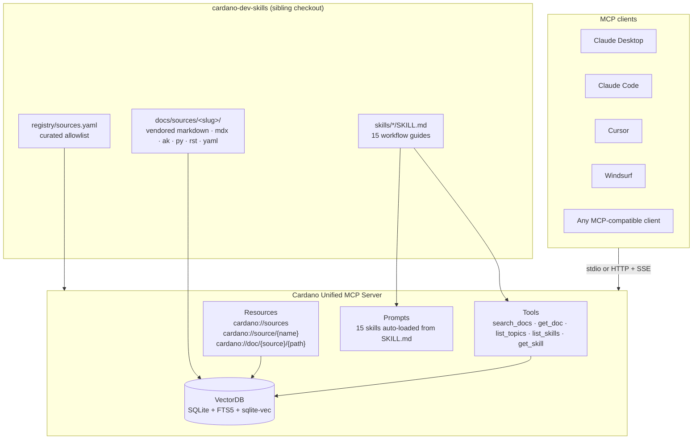
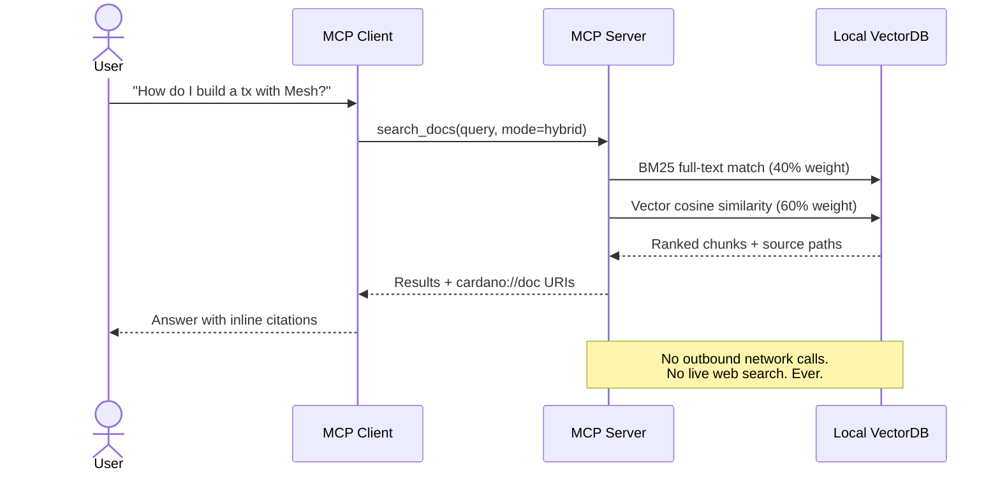
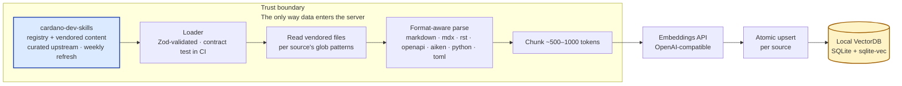

# Architecture

This document describes how the Cardano Unified MCP Server is put
together, how a query flows through it, and how documentation gets
ingested into it. For the trust model and governance, see
[`../ABOUT.md`](../ABOUT.md).

## Components at a glance

The server is a single stateless process. It exposes three MCP
surfaces — tools, resources, and prompts — and they all read from the
same local SQLite database. The database is the only place runtime
reads go. The server does **not** make outbound network calls during
a query.

## How a query works

**Three search modes** are supported:

- **Hybrid** (default) — BM25 full-text with Porter stemming, weighted
  at 40%, combined with vector cosine similarity at 60%. Best general
  recall.
- **Semantic** — vector similarity only. Useful when the query uses
  different vocabulary from the source.
- **Keyword** — BM25 only. Works without any embeddings API key; the
  mode you get on a local-dev install with no OpenAI credentials.

Every result carries its source identity: the source name, the file
path, and the `cardano://doc/{source}/{path}` URI. An assistant built
on top of this can always show the user where an answer came from.

## How ingestion works

The five phases, in order:

1. **Load + validate.** The skills registry at
   `${SKILLS_PATH}/registry/sources.yaml` is parsed and schema-checked
   with Zod (snake_case → camelCase mapping). A malformed entry
   (bad category, invalid URL, missing required field, duplicate name)
   aborts the entire ingest. The same loader runs nightly in CI against
   `cardano-dev-skills` HEAD via the
   [Skills Drift](../.github/workflows/skills-drift.yml) workflow, so
   upstream schema drift is caught before Sunday's indexer.
2. **Resolve.** Each source resolves to its vendored directory at
   `${SKILLS_PATH}/docs/sources/<slug>/`. Skills did the actual git
   cloning during its weekly refresh — this server never touches the
   network during ingest.
3. **Read + validate content.** Files are read according to
   `format`, `formatOverrides`, and `globPatterns`. A content
   validation pass catches empty sources, malformed OpenAPI, broken
   frontmatter.
4. **Chunk.** Documents are split into ~500–1000 token chunks. Each
   format has its own chunker: markdown splits on heading structure,
   OpenAPI splits per endpoint, Aiken splits per module/function with
   doc comments preserved.
5. **Embed + upsert.** Chunks are embedded via an OpenAI-compatible
   embeddings API, then upserted into SQLite. Each source is cleared
   and replaced atomically, so a partial failure can never leave the
   database in a half-refreshed state.

Ingestion runs weekly via a Kubernetes CronJob in the hosted
deployment. For local development you can run it manually with
`npm run ingest`, or skip embeddings entirely with
`--skip-embeddings` to iterate without burning API credits.

## Why this shape

A few design choices worth calling out:

- **Local SQLite, not a remote vector DB.** Stateless horizontal
  scaling: every replica reads the same database file from a
  persistent volume. No network hop to a remote vector store means
  lower p99 latency and no dependency on a third-party SaaS.
- **FTS5 + sqlite-vec in one file.** Full-text and vector indices
  live in the same database, so hybrid search is one transaction
  instead of two round-trips against two backends.
- **Allowlist over crawling.** Every ingested source is a public git
  URL listed in `cardano-dev-skills/registry/sources.yaml`. There is
  no crawler, no seed URL expansion, no live fetch at query time. This
  is the core of the project's trust model — see
  [`../ABOUT.md`](../ABOUT.md).
- **Curation lives upstream.** Source additions, removals, and glob
  refinements happen as PRs against `cardano-dev-skills`. This server
  is a downstream consumer with a thin overlay (chunking + embedding
  + MCP transport). Two repos, two concerns.
- **Attribution everywhere.** Every chunk stored in the database
  carries its source name, file path, and optional upstream URL. The
  MCP resources surface that attribution to the client, so a
  downstream assistant can always show the user where an answer came
  from.

## Deployment shape

For self-hosting, the server ships as:

- A Docker image (`easy1staking/cardano-one`).
- A Helm chart in [`../helm/`](../helm/) with two replicas, a
  persistent volume for the SQLite database, a weekly CronJob for
  re-ingestion, and optional session-affinity ingress.
- Plain `node dist/index.js --stdio` for local use with an MCP client
  that wants a stdio process.

See the [README](../README.md#self-hosting) for the full list of
environment variables and deployment options.
